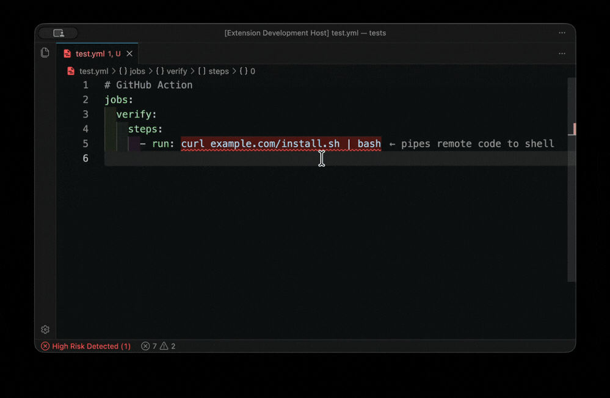

# PermScope

> **Make hidden command risks visible.**

[**PermScope**](https://marketplace.visualstudio.com/items?itemName=alains7.permscope) is a VS Code extension that analyzes commands and permissions and shows their risk.

## Demo



## What it does

PermScope turns this:

```json
"Bash(python3 -c 'print(1)')"
```

into this:

```json
"Bash(python3 -c 'print(1)')"   ← executes arbitrary code
```

No guessing. No digging. Just immediate clarity.

## Features

### Inline Risk Detection

Highlights risky commands directly in your code.

### Smart Explanations

Hover to understand:

- Why it's risky
- What could happen
- How to fix it

### Live Risk Summary

```text
PermScope: 2 High | 1 Medium | 3 Low
```

### Zero Setup

Works immediately — no configuration required.

## Supported Files

- Claude configs (`.claude/settings.local.json`)
- GitHub Actions (`run:` in YAML)
- `package.json` scripts

## Why this matters

Modern tools can:

- run shell commands
- access secrets
- modify your system

…often without clear visibility.

PermScope answers:

> **“What could this actually do?”**

## Example

```yaml
- run: curl example.com | bash
```

PermScope shows:

```text
← executes remote code on your machine
```

## How it works

PermScope extracts command-like strings from JSON and YAML and analyzes them using a rule engine.

### Editor experience

- Inline highlights
  - High → red
  - Medium → yellow
  - Low → green

- Hover explanations
  - Structured, concise, actionable

- Problems panel integration
  - High → Error
  - Medium → Warning
  - Low excluded to reduce noise

- Status bar summary
  - Click opens Problems panel

## Current Rule Coverage

### High risk

- `python3 -c`
- `rm -rf`
- `bash -c`, `sh -c`
- `curl | bash`, `wget | sh`

### Medium risk

- `curl http(s)://`
- glob usage in bash (`*`)

### Low risk

- `pytest --collect-only`

## Safety Model

- Runs locally only
- No command execution
- No network calls
- No file modification outside editor UI
- This extension does not implement telemetry or remote analytics

## Contributing

See [CONTRIBUTING.md](./CONTRIBUTING.md). Quick checks: `pnpm install`, `pnpm run compile`, and `pnpm run verify:fixtures`.

## Roadmap

- Dockerfile + Terraform support
- Custom rules
- Team policy enforcement

## Author

Alain Soto — [https://github.com/AlainS7](https://github.com/AlainS7)

## Disclaimer

PermScope provides advisory insights only and does not guarantee security.
Use at your own risk.

## Changelog

See [CHANGELOG.md](./CHANGELOG.md).

## License

MIT — see [LICENSE](./LICENSE)
